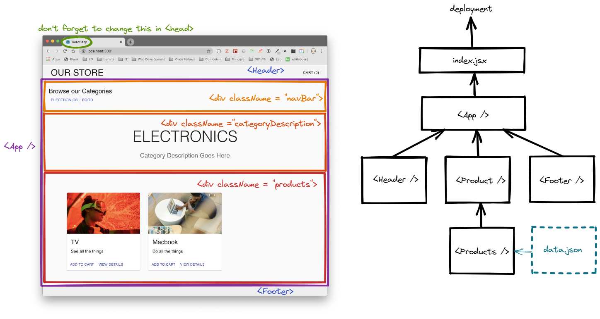

# LAB - Class 36

## Project: Storefront

### Author: Vida P.

### Links and Resources

- [ci/cd](http://xyz.com) (GitHub Actions)
- [back-end server url](http://xyz.com) (when applicable)
- [front-end application](http://xyz.com) (when applicable)
- [Reading Notes 36 -Topic](https://vida-1.github.io/reading-notes/read36_401.html)
- 
### Setup

#### `.env` requirements (where applicable)

i.e.

- `PORT` - 3000

<!-- npm init - to create a package.json file -->
<!-- npm install nodemon - lets you run your server locally (may need to be installed multiple times while working on a project) -->
npm install prettierrc - a linter that only seems to exist to break stuff
npm install jest - lets you use jest to test your code
npm install supertest - lets you use some special part of jest to test your code (something to do with grouping things together and/or "describe" look it up!
<!-- npm install express - lets you instantiate an express server -->
npm install react-if;
npm install has a <When></When> feature that allows for cleaner conditional rendering
npm install jwt-decode
npm install @reduxjs/toolkit

#### How to initialize/run your application

`npm start`

#### How to use your library (where applicable)

#### Tests

- How do you run tests?
- Any tests of note?
- Describe any tests that you did not complete, skipped, etc

#### UML

* 
